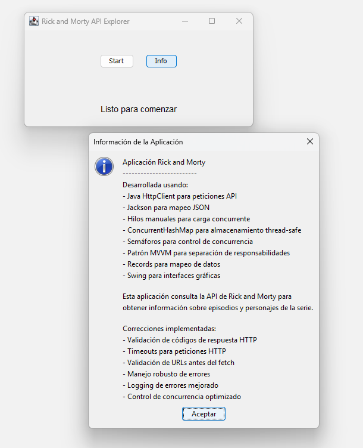
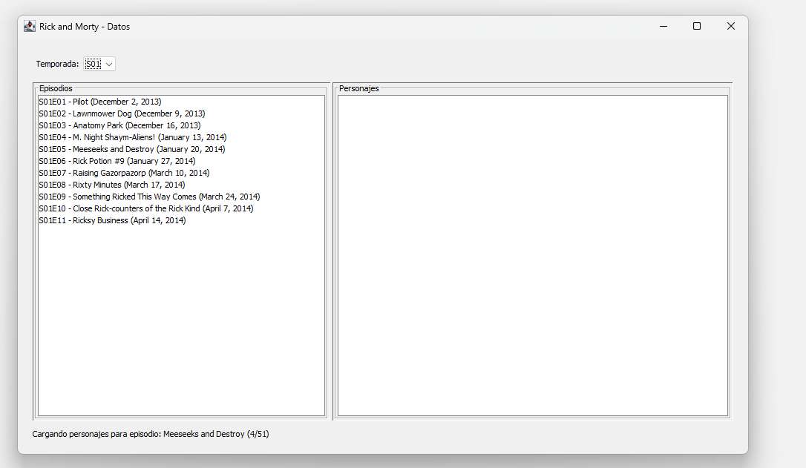
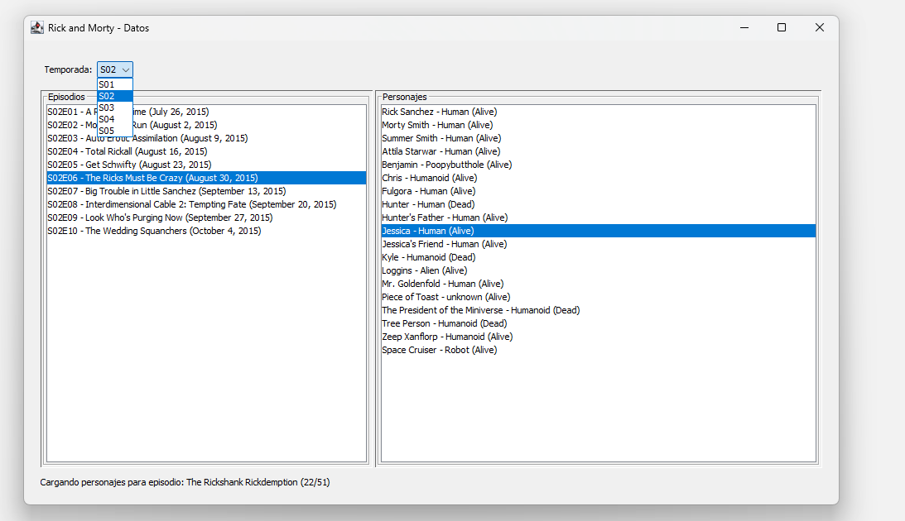

# Rick and Morty API Explorer

Un miniproyecto de clase desarrollado en Java que consume la [API de Rick and Morty](https://rickandmortyapi.com/) para explorar episodios y personajes de la serie.

## Descripción

Esta aplicación permite visualizar todos los episodios de Rick and Morty organizados por temporadas, y consultar los personajes que aparecen en cada episodio. Desarrollada como proyecto académico para demostrar el consumo de APIs REST y el manejo de concurrencia en Java.

## Características

- **Exploración por temporadas**: Visualiza episodios organizados por temporadas
- **Información detallada**: Muestra datos de episodios (nombre, código, fecha de emisión)
- **Personajes por episodio**: Carga y muestra todos los personajes que aparecen en cada episodio
- **Interfaz gráfica**: Aplicación Swing con interfaz intuitiva
- **Carga concurrente**: Utiliza múltiples threads para cargar datos de forma eficiente
- **Manejo de rate limiting**: Implementa reintentos y delays para respetar límites de la API

## Tecnologías Utilizadas

- **Java 21**: Lenguaje principal con Records y nuevas características
- **Jackson**: Librería para mapeo JSON
- **HttpClient**: Cliente HTTP nativo de Java
- **Swing**: Framework para la interfaz gráfica
- **Maven**: Gestión de dependencias y construcción del proyecto
- **Concurrencia**: Threads manuales, Semaphores, ConcurrentHashMap

## Estructura del Proyecto

```
src/main/java/aog/rickymortyapp/
├── model/
│   ├── Charac.java          # Record para personajes
│   ├── Episode.java         # Record para episodios
│   ├── Info.java           # Record para información de paginación
│   └── PaginatedResponse.java # Record para respuestas paginadas
├── service/
│   └── ApiService.java      # Servicio para consumir la API
├── view/
│   ├── DataView.java        # Vista principal con datos
│   └── StartView.java       # Vista de inicio
├── viewModel/
│   └── RickAndMortyViewModel.java # Lógica de negocio (patrón MVVM)
├── Main.java               # Clase principal
└── assets/
    ├── screenshot01.png
    ├── screenshot02.png
    └── screenshot03.png
```

## Uso de la Aplicación

1. **Pantalla de Inicio**: Haz clic en "Start" para comenzar la carga de datos
2. **Carga de Datos**: La aplicación descargará todos los episodios y personajes
3. **Exploración**: 
   - Selecciona una temporada del dropdown
   - Haz clic en un episodio para ver sus personajes
   - La información se muestra en tiempo real

## Arquitectura

### Patrón MVVM (Model-View-ViewModel experimental)
- **Model**: Records que representan los datos de la API
- **View**: Clases Swing para la interfaz de usuario
- **ViewModel**: Lógica de negocio y manejo del estado

### Concurrencia
- **Semaphore**: Control de peticiones concurrentes (máximo 2 simultáneas)
- **Threads manuales**: Cada episodio se procesa en su propio hilo
- **ConcurrentHashMap**: Almacenamiento thread-safe de datos

### Manejo de API
- **Rate Limiting**: Sistema de reintentos
- **Procesamiento por lotes**: Personajes cargados en grupos de 3
- **Timeouts**: Configurados para evitar bloqueos

## Rendimiento

- **~51 episodios** cargados desde la API
- **~Múltiples personajes** únicos procesados
- **Manejo resiliente** de errores HTTP 429
- **Tiempo de carga**: ~2-3 minutos (en mi experiencia)

## Screenshots

### Pantalla de Inicio


*Interfaz principal con botones de inicio e información*

### Vista de Datos - Episodios por Temporada

*Listado de episodios*

### Personajes del Episodio Seleccionado

*Navegación por temporadas y visualización de personajes que aparecen en cada episodio*

## Solución de Problemas Conocidos

### Error HTTP 429 (Too Many Requests)
- **Problema**: La API limita las peticiones por minuto
- **Solución**: Implementado sistema de reintentos con delays incrementales

### Timeouts de Conexión
- **Problema**: Algunas peticiones pueden tardar mucho
- **Solución**: Timeouts configurados a 30 segundos con reintentos

### Memory Management
- **Problema**: Carga de muchos datos simultáneamente
- **Solución**: Procesamiento por lotes y limpieza de recursos

## Conceptos Académicos Adquiridos

- **Consumo de APIs REST**: Peticiones HTTP con Jackson para JSON
- **Programación Concurrente**: Threads, Semaphores, sincronización
- **Patrones de Diseño**: MVVM, Observer (callbacks)
- **Manejo de Errores**: Try-catch, reintentos
- **Interfaz Gráfica**: Swing, event handling, threading en UI
- **Gestión de Dependencias**: Maven

## Notas del Desarrollo

Este proyecto fue diseñado para mostrar:
1. Cómo consumir una API REST real
2. Manejo de respuestas asíncronas y concurrencia

## Autor

Proyecto desarrollado como miniproyecto de clase por Antonio Ortega.

## Licencia

Proyecto académico desarrollado con fines educativos para asignatura de Programación de Procesos y Servicios.
